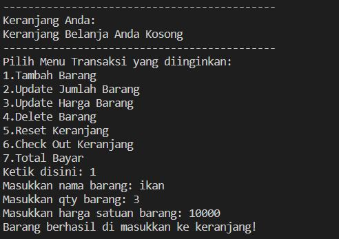

<h1>Cashier Project ThrustMart</h1>

<h2>LATAR BELAKANG PROJECT</h2>

Super Cashier Project merupakan sistem kasir sederhana menggunakan bahasa pemrograman python untuk memudahkan pembeli melakukan transaksi di sebuah toko.

<h2>REQUIREMENT/ OBJECTIVES</h2>
1. Menginput iitem yang ingin dibeli
2. Menampilkan keranjang berisi barang yang akan dibeli
3. Edit barang yang akan dibeli pada   keranjang
    * Update nama item
    * Update qty
    * Update harga
4. Menghapus barang yang akan dibeli pada keranjang
    * Delete salah satu item yang tidak jadi dibeli
5. Reset seluruh item yang tidak jadi dibeli (reset/ kosongkan keranjang)
6. Check order barang yang akan dibeli 
    * Jika benar, menampilkan pesan “Pemesanan sudah benar”
    * Jika ada kekeliruan, menampilkan pesan “Terdapat kesalahan input data”
7. Menampilkan pemesanan yang fix dibeli (check out)
8. Menghitung total belanja yang sudah dibeli
9. Memberikan diskon
    * Jika pembelian > Rp 200.000 mendapatkan diskon 5%
    * Jika pembelian > Rp 300.000 mendapatkan diskon 8%
    * Jika pembelian > Rp 500.000 mendapatkan diskon 10%

<h2>FLOWCHART SEDERHANA PROGRAM</h2>

Berikut flowchart sederhana program yang dibuat

<h2>SNIPPED CODE</h2>

<h3>INISIASI CLASS</h3>
Method dan atribut pada program cashier ini disimpan pada sebuah class bernama Transaction.

berikut ini tampilan saat inisiasi kelas

<h3>FITUR MAIN MENU</h3>

code menampilkan menu untuk input transaksi program

output ketika code dijalankan

<h3>FITUR TAMBAH BARANG</h3>

code untuk melakukan input tambah barang 

output ketika code dijalankan

output ketika menambah barang berupa Nama Barang: Ikan Qty: 3 Harga: Rp 10.000

Hasil setelah berhasil ditambahkan ke keranjang 

Update hasil setelah berhasil menambahkan lagi Nama Barang: ayam bakar Qty: 3 Harga: Rp 30.000 ditambahkan ke keranjang 

<h3>FITUR UPDATE QTY BARANG</h3>

code untuk melakukan input update qty barang 

output ketika code dijalankan dan ingin mengubah nama barang: **"IKAN"**

output ketika mengubah qty barang berupa Nama Barang: Ikan **Qty baru : 5**

<h3>FITUR UPDATE HARGA BARANG</h3>

code untuk melakukan input update harga barang 

output ketika code dijalankan dan ingin mengubah harga barang: **"AYAM BAKAR"**

output ketika mengubah harga barang berupa Nama Barang: Ayam Bakar **Harga baru : Rp50.000**

<h3>FITUR DELETE/HAPUS SALAH SATU BARANG</h3>

code untuk melakukan delete/hapus barang 

output ketika code dijalankan dan ingin delete/hapus barang: **"IKAN"**

output ketika selesai delete/hapus Nama Barang: **IKAN**

<h3>FITUR RESET SELURUH BARANG DI KERANJANG</h3>

code untuk melakukan reset barang di keranjang

output ketika code dijalankan  **reset seluruh barang di keranjang**

output ketika selesai **reset seluruh barang di keranjang**

output ketika code dijalankan  **reset seluruh barang di keranjang**

output ketika selesai **reset seluruh barang di keranjang**

<h3>FITUR CEKOUT BARANG DI KERANJANG</h3>

code untuk melakukan pengecekan barang di keranjang

code untuk melakukan pengecekan check order/ checkout di keranjang

output ketika code dijalankan  **check order/ checkout**

<h3>FITUR TOTAL HARGA</h3>

code method untuk melakukan perhitungan total belanja dan final price.

jika mencapai total belanja mencapai suatu nilai, akan mendapatkan diskon sehingga final price = total belanja * (1-discount)

code method untuk melakukan pengecekan besaran diskon yang didapatkan oleh pelanggan

output ketika method  **Total Harga** dijalankan

